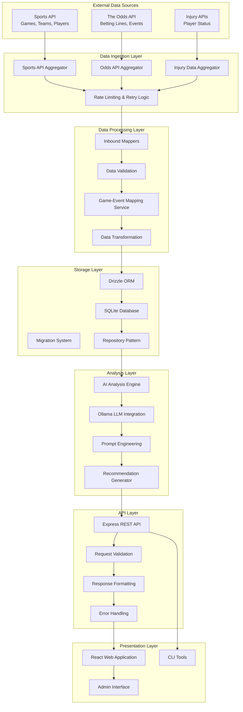
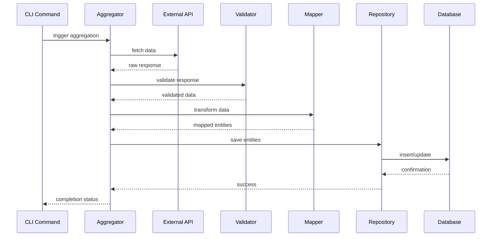
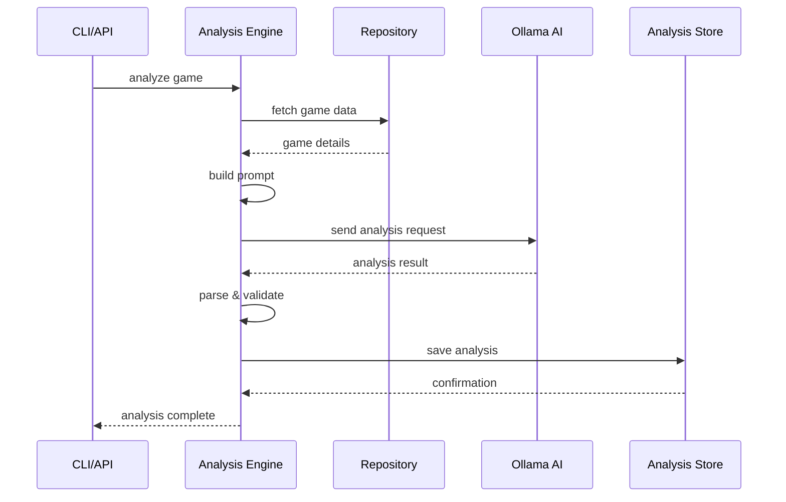
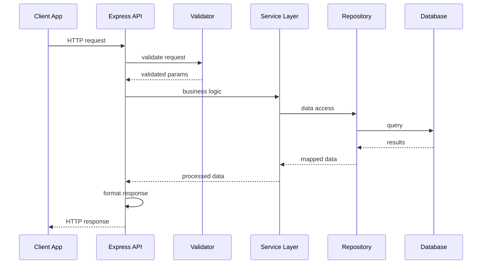
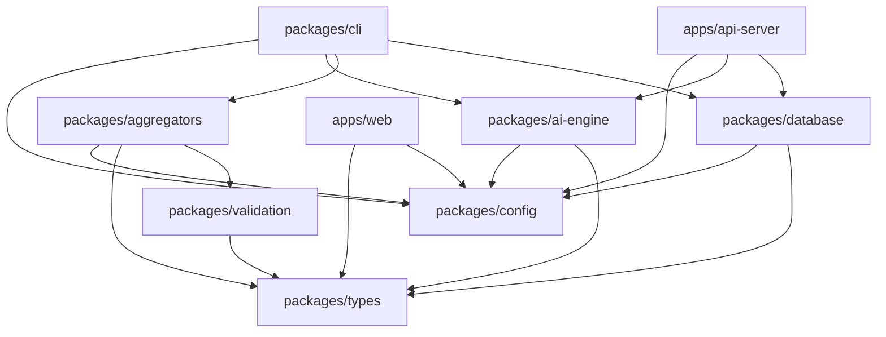
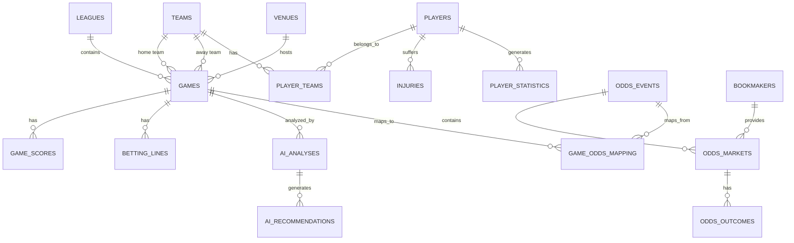

# LINA Architecture Documentation

This document provides a comprehensive overview of the LINA (Line Analysis Assistant) system architecture, design decisions, and implementation patterns.

## System Overview

LINA is designed as a modular monorepo application that follows a layered architecture pattern with clear separation of concerns. The system processes sports betting data through multiple stages: collection, storage, analysis, and presentation.

## High-Level Architecture



## Architectural Principles

### 1. Separation of Concerns

Each layer has a single, well-defined responsibility:

- **Data Ingestion**: Fetching and initial processing of external data
- **Data Processing**: Transformation and validation of raw data
- **Storage**: Persistent data management and access
- **Analysis**: AI-powered analysis and recommendation generation
- **API**: HTTP interface for data access and operations
- **Presentation**: User interfaces for data visualization and interaction

### 2. Dependency Inversion

Higher-level modules don't depend on lower-level modules. Both depend on abstractions:

```typescript
// High-level module depends on abstraction
class AnalysisEngine {
  constructor(
    private gameRepository: IGameRepository,
    private aiService: IAIService
  ) {}
}

// Low-level modules implement abstractions
class DrizzleGameRepository implements IGameRepository {
  // Implementation details
}

class OllamaAIService implements IAIService {
  // Implementation details
}
```

### 3. Single Responsibility Principle

Each component has one reason to change:

- **Aggregators**: Only change when API contracts change
- **Mappers**: Only change when data transformation logic changes
- **Repositories**: Only change when data access patterns change
- **Services**: Only change when business logic changes

### 4. Open/Closed Principle

Components are open for extension but closed for modification:

```typescript
// Base aggregator provides common functionality
abstract class BaseAggregator {
  protected async makeRequest<T>(url: string): Promise<T> {
    // Common request logic
  }
}

// Specific aggregators extend base functionality
class SportsApiAggregator extends BaseAggregator {
  async fetchGames(date: string): Promise<Game[]> {
    // Sports API specific logic
  }
}
```

## Data Flow Architecture

### 1. Data Ingestion Flow



### 2. Analysis Flow



### 3. API Request Flow



## Component Architecture

### 1. Monorepo Structure

```
lina/
├── packages/                 # Shared packages
│   ├── types/               # Type definitions
│   ├── constants/           # Application constants
│   ├── config/             # Configuration management
│   ├── database/           # Database layer
│   ├── aggregators/        # Data collection
│   ├── ai-engine/          # AI analysis
│   ├── validation/         # Data validation
│   └── cli/               # Command-line tools
├── apps/                   # Applications
│   ├── api-server/        # REST API server
│   └── web/              # React web app
└── db/                   # Database files
```

### 2. Package Dependencies



### 3. Database Architecture

#### Schema Design

The database follows a normalized design with clear entity relationships:



#### Data Access Patterns

**Repository Pattern Implementation:**

```typescript
interface IGameRepository {
  findById(id: number): Promise<Game | null>;
  findByDate(date: string): Promise<Game[]>;
  findByTeam(teamId: number): Promise<Game[]>;
  create(game: CreateGameData): Promise<Game>;
  update(id: number, data: UpdateGameData): Promise<Game>;
}

class DrizzleGameRepository implements IGameRepository {
  constructor(private db: DrizzleDatabase) {}
  
  async findById(id: number): Promise<Game | null> {
    const result = await this.db
      .select()
      .from(games)
      .leftJoin(teams, eq(games.homeTeamId, teams.id))
      .where(eq(games.id, id))
      .limit(1);
    
    return result.length > 0 ? this.mapToGame(result[0]) : null;
  }
}
```

### 4. AI Analysis Architecture

#### Analysis Engine Design

```typescript
class AnalysisEngine {
  constructor(
    private ollama: Ollama,
    private gameRepository: IGameRepository,
    private oddsRepository: IOddsRepository,
    private promptBuilder: PromptBuilder
  ) {}
  
  async analyzeGame(gameId: number): Promise<Analysis> {
    // 1. Gather comprehensive game data
    const gameData = await this.gatherGameData(gameId);
    
    // 2. Build analysis prompt
    const prompt = this.promptBuilder.buildGameAnalysisPrompt(gameData);
    
    // 3. Execute AI analysis
    const response = await this.ollama.generate({
      model: 'llama3.1:8b',
      prompt,
      options: { temperature: 0.7 }
    });
    
    // 4. Parse and validate response
    const analysis = this.parseAnalysisResponse(response);
    
    // 5. Generate recommendations
    const recommendations = await this.generateRecommendations(analysis);
    
    return { ...analysis, recommendations };
  }
}
```

#### Prompt Engineering Strategy

```typescript
class PromptBuilder {
  buildGameAnalysisPrompt(gameData: GameData): string {
    return `
    You are a professional sports betting analyst. Analyze the following game data and provide betting recommendations.

    GAME INFORMATION:
    ${this.formatGameInfo(gameData.game)}

    TEAM STATISTICS:
    ${this.formatTeamStats(gameData.homeTeam, gameData.awayTeam)}

    INJURY REPORT:
    ${this.formatInjuries(gameData.injuries)}

    BETTING LINES:
    ${this.formatBettingLines(gameData.odds)}

    HISTORICAL MATCHUPS:
    ${this.formatHistoricalData(gameData.history)}

    ANALYSIS REQUIREMENTS:
    1. Evaluate team form and recent performance
    2. Assess impact of key injuries
    3. Analyze betting line value
    4. Consider weather and venue factors
    5. Provide confidence scores (0.0-1.0)
    6. Calculate expected value for recommendations

    OUTPUT FORMAT:
    {
      "confidence": 0.85,
      "reasoning": "Detailed analysis...",
      "recommendations": [
        {
          "type": "spread",
          "pick": "home",
          "confidence": 0.85,
          "expectedValue": 0.12,
          "reasoning": "..."
        }
      ]
    }
    `;
  }
}
```

## Performance Considerations

### 1. Database Optimization

**Indexing Strategy:**
```sql
-- Game lookups by date and team
CREATE INDEX idx_games_date ON games(date);
CREATE INDEX idx_games_teams ON games(home_team_id, away_team_id);

-- Odds lookups by event and bookmaker
CREATE INDEX idx_odds_event ON odds_outcomes(market_id);
CREATE INDEX idx_odds_bookmaker ON odds_markets(bookmaker_id);

-- Analysis lookups by game and confidence
CREATE INDEX idx_analysis_game ON ai_analyses(game_id, confidence);
```

**Query Optimization:**
```typescript
// Efficient game loading with related data
async findGameWithDetails(gameId: number): Promise<GameWithDetails> {
  return await this.db
    .select({
      game: games,
      homeTeam: homeTeam,
      awayTeam: awayTeam,
      venue: venues,
      odds: sql<OddsData>`json_group_array(odds_outcomes.*)`
    })
    .from(games)
    .leftJoin(homeTeam, eq(games.homeTeamId, homeTeam.id))
    .leftJoin(awayTeam, eq(games.awayTeamId, awayTeam.id))
    .leftJoin(venues, eq(games.venueId, venues.id))
    .leftJoin(oddsMarkets, eq(games.id, oddsMarkets.gameId))
    .leftJoin(oddsOutcomes, eq(oddsMarkets.id, oddsOutcomes.marketId))
    .where(eq(games.id, gameId))
    .groupBy(games.id);
}
```

### 2. API Rate Limiting

**Intelligent Rate Limiting:**
```typescript
class RateLimiter {
  private requests: Map<string, number[]> = new Map();
  
  async checkLimit(apiKey: string, limit: number, window: number): Promise<boolean> {
    const now = Date.now();
    const requests = this.requests.get(apiKey) || [];
    
    // Remove requests outside the window
    const validRequests = requests.filter(time => now - time < window);
    
    if (validRequests.length >= limit) {
      const oldestRequest = Math.min(...validRequests);
      const waitTime = window - (now - oldestRequest);
      await this.sleep(waitTime);
    }
    
    validRequests.push(now);
    this.requests.set(apiKey, validRequests);
    return true;
  }
}
```

### 3. Caching Strategy

**Multi-Level Caching:**
```typescript
class CacheManager {
  constructor(
    private memoryCache: Map<string, any>,
    private redisCache?: Redis
  ) {}
  
  async get<T>(key: string): Promise<T | null> {
    // L1: Memory cache
    if (this.memoryCache.has(key)) {
      return this.memoryCache.get(key);
    }
    
    // L2: Redis cache
    if (this.redisCache) {
      const value = await this.redisCache.get(key);
      if (value) {
        const parsed = JSON.parse(value);
        this.memoryCache.set(key, parsed);
        return parsed;
      }
    }
    
    return null;
  }
}
```

## Security Architecture

### 1. API Security

**Authentication & Authorization:**
```typescript
class AuthMiddleware {
  async authenticate(req: Request, res: Response, next: NextFunction) {
    const token = req.headers.authorization?.replace('Bearer ', '');
    
    if (!token) {
      return res.status(401).json({ error: 'No token provided' });
    }
    
    try {
      const payload = jwt.verify(token, process.env.JWT_SECRET!);
      req.user = payload;
      next();
    } catch (error) {
      return res.status(401).json({ error: 'Invalid token' });
    }
  }
}
```

**Input Validation:**
```typescript
const gameQuerySchema = z.object({
  date: z.string().regex(/^\d{4}-\d{2}-\d{2}$/).optional(),
  league: z.coerce.number().positive().optional(),
  limit: z.coerce.number().min(1).max(100).default(50),
  offset: z.coerce.number().min(0).default(0)
});

app.get('/games', validate(gameQuerySchema), async (req, res) => {
  // Validated request handling
});
```

### 2. Data Protection

**Sensitive Data Handling:**
```typescript
class ConfigManager {
  private static maskSensitiveValue(key: string, value: string): string {
    const sensitiveKeys = ['api_key', 'secret', 'password', 'token'];
    
    if (sensitiveKeys.some(sensitive => key.toLowerCase().includes(sensitive))) {
      return value.length > 4 
        ? `${value.substring(0, 4)}${'*'.repeat(value.length - 4)}`
        : '****';
    }
    
    return value;
  }
}
```

## Monitoring and Observability

### 1. Logging Strategy

**Structured Logging:**
```typescript
class Logger {
  private winston: Winston.Logger;
  
  constructor() {
    this.winston = winston.createLogger({
      format: winston.format.combine(
        winston.format.timestamp(),
        winston.format.errors({ stack: true }),
        winston.format.json()
      ),
      transports: [
        new winston.transports.File({ filename: 'logs/error.log', level: 'error' }),
        new winston.transports.File({ filename: 'logs/combined.log' }),
        new winston.transports.Console({ format: winston.format.simple() })
      ]
    });
  }
  
  logApiRequest(req: Request, res: Response, duration: number) {
    this.winston.info('API Request', {
      method: req.method,
      url: req.url,
      statusCode: res.statusCode,
      duration,
      userAgent: req.get('User-Agent'),
      ip: req.ip
    });
  }
}
```

### 2. Health Monitoring

**Health Check System:**
```typescript
class HealthChecker {
  async checkHealth(): Promise<HealthStatus> {
    const checks = await Promise.allSettled([
      this.checkDatabase(),
      this.checkOllama(),
      this.checkExternalAPIs(),
      this.checkDiskSpace()
    ]);
    
    return {
      status: checks.every(check => check.status === 'fulfilled') ? 'healthy' : 'unhealthy',
      checks: checks.map((check, index) => ({
        name: ['database', 'ollama', 'apis', 'disk'][index],
        status: check.status,
        details: check.status === 'fulfilled' ? check.value : check.reason
      })),
      timestamp: new Date().toISOString()
    };
  }
}
```

## Deployment Architecture

### 1. Development Environment

```yaml
# docker-compose.dev.yml
version: '3.8'
services:
  lina-api:
    build: .
    ports:
      - "3001:3001"
    environment:
      - NODE_ENV=development
    volumes:
      - ./:/app
      - /app/node_modules
    depends_on:
      - ollama

  lina-web:
    build: ./apps/web
    ports:
      - "3000:3000"
    environment:
      - REACT_APP_API_URL=http://localhost:3001
    volumes:
      - ./apps/web:/app
      - /app/node_modules

  ollama:
    image: ollama/ollama
    ports:
      - "11434:11434"
    volumes:
      - ollama_data:/root/.ollama

volumes:
  ollama_data:
```

### 2. Production Deployment

**Container Strategy:**
```dockerfile
# Multi-stage build for production
FROM node:18-alpine AS builder
WORKDIR /app
COPY package*.json ./
RUN npm ci --only=production

FROM node:18-alpine AS runtime
WORKDIR /app
COPY --from=builder /app/node_modules ./node_modules
COPY . .
RUN npm run build

EXPOSE 3001
CMD ["npm", "start"]
```

This architecture provides a solid foundation for the LINA system with clear separation of concerns, scalability considerations, and maintainability features.